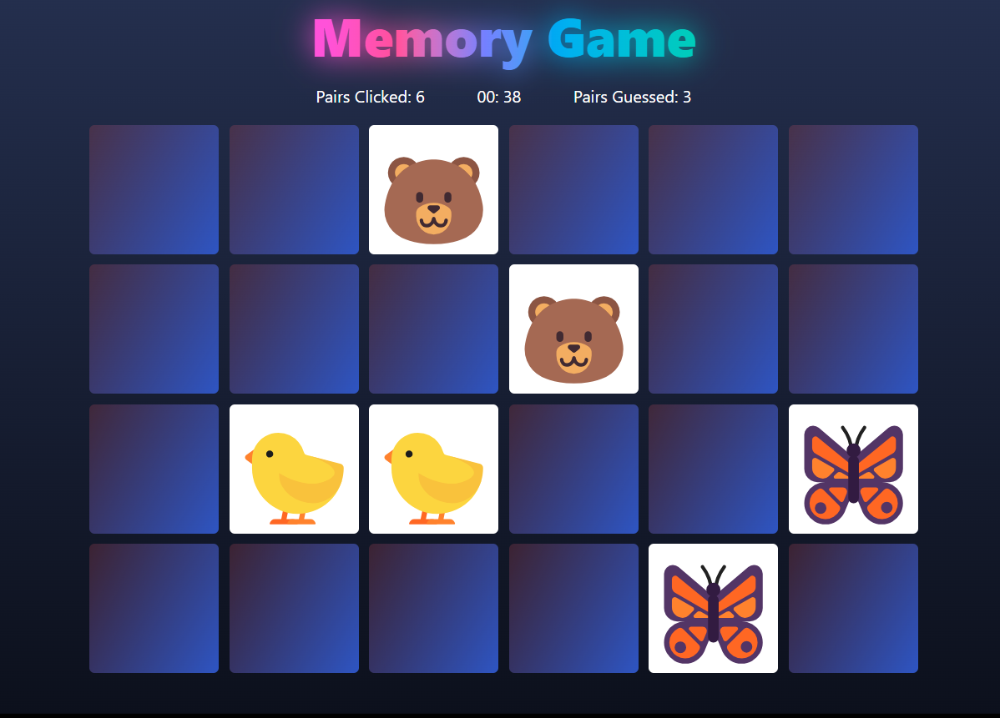

# Memory Game

## Beschreibung

Dies ist ein einfaches Memory-Spiel, bei dem Karten umgedreht werden, um übereinstimmende Paare zu finden.
Das Spiel ist mit HTML, CSS und TypeScript entwickelt.

Hier kannst du es direkt ausprobieren ohne etwas herunterladen zu müssen: 

https://my-emoji-memory-game.netlify.app/



## Funktionen

-   Karten umdrehen und Übereinstimmungen finden
-   Punkte basierend auf gefundenen Paaren
-   Einfache und benutzerfreundliche Oberfläche

## Installation

1. Klone das Repository:

    ```bash
    git clone https://github.com/Mark1U/memory.git

    ```

2. Navigiere zum Projektordner:

    ```bash
    cd memory

    ```

3. Installiere alle benötigten Module:

    ```bash
    npm i
    ```

4. Öffne die `index.html` Datei in deinem bevorzugten Browser.

## Nutzung

Klicke auf eine Karte, um sie umzudrehen.
Finde alle passenden Paare, um das Spiel zu gewinnen.

## Beiträge

Beiträge sind willkommen!
Bitte erstelle einen Pull-Request oder öffne ein Issue, um Fehler zu melden oder neue Funktionen vorzuschlagen.

## Lizenz

Dieses Projekt steht unter der MIT-Lizenz.
